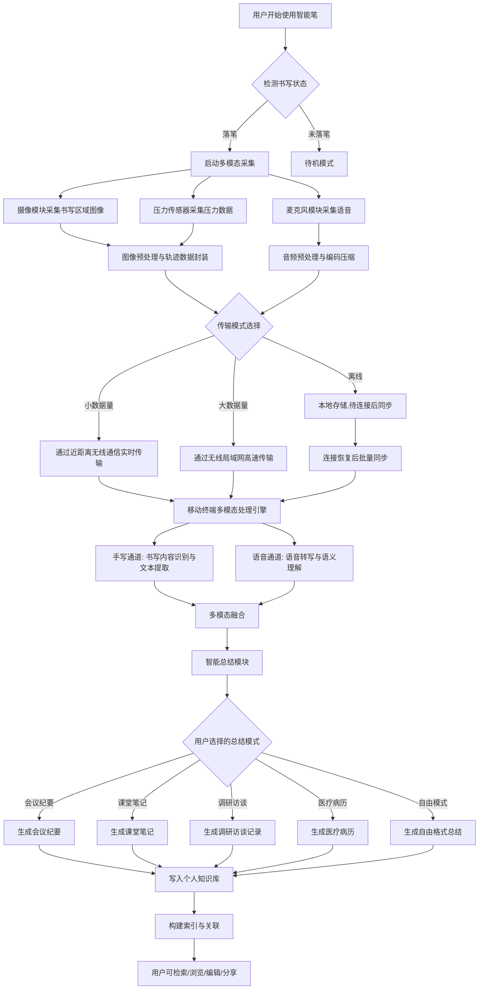
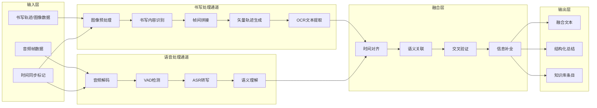

# 一种基于图像识别与语音采集的智能笔系统及方法（发明专利申请）

---

## 发明名称

一种基于图像识别与语音采集的智能笔系统及方法

---

## 技术领域

本发明涉及智能书写设备技术领域，尤其涉及一种基于图像识别与语音采集的智能笔系统及方法。本发明融合了人工智能、图像处理算法与嵌入式电子电路技术，属于多学科交叉技术领域。

---

## 背景技术

随着信息化时代的深入发展，个人知识管理的电子化需求日益增长。在会议记录、课堂笔记、访谈调研、医疗问诊等场景中，大量信息仍以传统的纸笔书写和口头交流形式存在，尚未实现有效的电子化采集与管理。目前市场上已有多种智能书写设备和语音采集技术，但两者在深度融合方面仍存在显著不足。现将相关背景技术分为书写数字化和语音采集两大类分别阐述。

### 书写数字化技术

**（1）点阵笔技术**：以Livescribe智能笔、Neo smartpen等为代表，通过在笔尖处安装红外摄像头，读取印有点阵编码的专用纸张上的位置信息，从而实现笔迹数字化。该类技术的代表性专利包括US8374992B2等。其核心缺陷在于**必须配合专用点阵纸使用**，使用成本高、携带不便，且无法在普通纸张或其他日常书写材料上工作。

**（2）电磁感应技术**：以Wacom公司Bamboo系列为代表，利用电磁感应原理，通过在书写板下方嵌入电磁感应层捕捉触控笔的位置和压力。虽然Wacom也推出了Bamboo Folio、Bamboo Slate等可在普通纸张上书写的产品，但需要将纸张夹在特殊的书写板上，不具备真正的便携性，且无法记录书写载体上的已有内容。

**（3）惯性测量技术**：如中国专利CN204172543U所公开的方案，通过内置加速度计、陀螺仪等惯性传感器记录笔的运动轨迹来还原笔迹。该类方案虽然无需专用纸张，但笔迹还原精度受书写角度、速度、握笔姿势等因素影响较大，难以实现高保真的原笔迹复原。

**（4）超声波定位技术**：部分智能笔采用超声波和红外线结合的方式进行定位，笔尖发出超声波信号，接收器通过计算信号到达时间差确定笔的位置。这种技术可以在普通纸张上使用，但需要在书写区域放置接收装置，便携性受限。

**（5）光学识别与基于摄像头的书写识别技术**：如US7889928B2公开的基于视频的手写输入方案，以及苹果公司US8,922,530"Communicating Stylus"专利。一些产品使用笔尖集成的微型摄像头，通过光学识别技术追踪纸张表面的纹理或标记图案记录书写内容。该类技术对纸张要求相对较低，但现有方案未能实现连续书写内容的高精度拼接还原和矢量轨迹生成，也缺乏语音同步采集能力。

### 语音采集与处理技术

**（6）录音笔技术**：以索尼、Zoom等品牌为代表的专业录音笔，通过内置麦克风阵列采集环境声音并存储为音频文件。这类设备专注于音频采集质量，但不具备与书写动作的联动能力。

**（7）智能语音助手与语音转写服务**：智能手机、智能音箱等集成了远场语音识别技术（如Siri、Google Assistant），以及基于云计算的语音转文字服务（如科大讯飞、Google Speech-to-Text、Whisper等）可将语音实时或离线转换为文本。但这类技术作为独立应用运行，语音采集与书写场景完全独立，缺乏与书写输入的深度融合。

### 现有多模态产品的局限

市场上存在一些同时具备录音和书写功能的智能笔（如Livescribe系列），但其存在以下不足：

1. **书写与语音采集相互独立**：即便少数产品将录音和书写集成在同一设备中，也仅仅是物理层面的组合——录音和书写记录各自独立运行，缺乏数据层面的时间同步和语义关联。用户需要手动关联"哪段录音对应哪段笔记"，极大地降低了使用效率和信息检索的便利性。

2. **依赖特殊书写介质**：现有产品必须使用专用的点阵纸张或配套书写板，增加了使用成本，限制了应用场景，用户无法在普通纸张、笔记本或其他日常书写材料上自由使用。

3. **缺乏多模态信息融合能力**：现有产品在采集到手写和语音信息后，通常将两种信息独立存储和展示，缺乏深层的融合处理能力，无法自动将语音中的关键信息与手写笔记中的对应内容进行关联、互补和校验。

4. **缺乏将原始笔迹图像智能还原为矢量轨迹的能力**：现有摄像头类书写识别方案未能实现连续书写内容的高精度帧间拼接和矢量轨迹生成，仅能获得低质量的位图或简单的坐标序列。

5. **无智能提取与总结功能**：现有产品仅提供原始数据的存储和回放，用户需要自行阅读笔记和听取录音来提取有用信息，缺乏自动化的语音转写、关键信息识别、主题分类和智能总结能力。

6. **不支持个性化知识管理**：现有产品的数据以单次会话或单页笔记为单位孤立存储，不支持跨会话、跨主题的知识组织和关联，无法帮助用户建立系统化的个人知识库。

---

## 发明内容

### 一、发明目的

本发明的目的在于克服上述现有技术的不足，提供一种基于图像识别与语音采集的智能笔系统及方法，能够在普通纸张上实现高保真的原笔迹复原，同时同步采集语音信息，并基于人工智能技术实现语音转写和内容总结，从而实现个人知识信息的全流程电子化。

### 二、技术方案

为实现上述目的，本发明采用如下技术方案：

**一种基于图像识别与语音采集的智能笔系统，包括智能笔终端、移动终端应用程序和云端服务平台三个层级，其特征在于：**

所述智能笔终端包括：
- **笔体结构**：外形接近传统书写工具，内部集成各功能模块；
- **摄像模块**：安装于笔尖附近区域，镜头朝向书写面方向，用于逐帧拍摄书写区域；
- **麦克风模块**：安装于笔体上远离用户手部覆盖区域的位置，用于采集环境语音；
- **书写状态检测传感器**：设置于笔尖处，用于检测书写状态；
- **主控芯片**：分别与摄像模块、麦克风模块、书写状态检测传感器连接，用于协调各模块工作；
- **存储模块**：用于存储采集的图像数据和音频数据；
- **无线通信模块**：用于与移动终端进行数据传输，支持近距离无线通信和无线局域网通信中的至少一种；
- **电池模块**：用于为各模块供电；
- **充电模块**：支持有线充电和/或充电盒充电。

所述移动终端应用程序包括：
- **数据接收模块**：通过无线通信接收智能笔传输的压缩图像数据和音频数据；
- **笔迹还原处理模块**：包括图像预处理子模块、书写内容识别子模块、帧间拼接子模块和矢量轨迹生成子模块；
- **语音转写模块**：调用语音识别服务，将音频数据转写为文本；
- **时间同步模块**：基于时间戳将书写内容与语音转写文本进行关联同步；
- **AI总结模块**：将同步后的内容上传至云端，基于人工智能模型生成总结文档；
- **展示模块**：向用户展示原笔迹图像、矢量整理笔迹图、转写文本、音频录音和总结文档。

所述云端服务平台包括：
- **AI转写服务**：提供语音识别接口；
- **AI总结服务**：根据用户需求生成调研访谈纪要、会议纪要、学习笔记、课堂总结、医疗病历记录等不同类型的总结文档。

**一种基于图像识别与语音采集的智能笔的笔迹还原方法，包括以下步骤：**

**步骤S1：数据采集触发**
当用户开始书写时，笔尖处的书写状态检测传感器检测到书写信号，触发摄像模块开始逐帧拍摄；同步地，麦克风模块开始采集环境语音；为图像帧和音频数据分别打上时间戳。

**步骤S2：图像采集与预处理**
摄像模块持续拍摄笔尖附近的书写区域图像；主控芯片对采集的图像进行压缩处理，并执行包括防抖处理、图像增强和畸变校正在内的预处理操作。

**步骤S3：书写内容识别与裁切**
移动终端应用程序接收到图像数据后，通过图像识别算法识别图像中的书写内容区域，裁切出有效书写内容区域，去除背景区域。

**步骤S4：帧间特征匹配与拼接**
由于连续帧之间存在拍摄区域重叠，提取相邻帧之间的特征点进行匹配，基于匹配的特征点计算帧间的位移和变换关系，将裁切后的各帧图像按照空间位置关系进行拼接，形成完整的书写页面图像。

**步骤S5：矢量轨迹生成**
对拼接后的完整书写图像进行轨迹像素点识别，提取书写轨迹中各像素点的坐标位置，按照坐标顺序依次连线，生成矢量格式的轨迹图。

**步骤S6：语音转写与时间同步**
将采集的音频数据上传至云端AI转写服务，获得转写文本；基于音频数据和图像数据上携带的时间戳，将转写文本与对应的书写内容进行时间关联。

**步骤S7：AI内容总结**
将同步后的书写内容和转写文本上传至云端AI总结服务，根据用户选择的文档类型（会议纪要、学习笔记、调研访谈、课堂总结、医疗病历等），生成结构化的总结文档。

### 三、有益效果

采用本发明所述的技术方案，与现有技术相比，具有以下有益效果：

1. **无需专用纸张**：通过摄像头逐帧拍摄结合AI图像识别和帧间拼接技术，实现在普通纸张上的原笔迹高保真复原，无需使用点阵纸、电磁板等专用载体，大幅降低使用成本，提升便捷性。

2. **书写与语音同步采集**：通过压力传感器触发机制和时间戳同步技术，实现书写内容和语音内容的时间关联，用户可以精确回溯某一笔迹对应的语音内容，反之亦然。

3. **原笔迹矢量还原**：通过AI图像识别裁切、特征点匹配拼接、像素坐标提取和SVG轨迹生成技术，将纸质书写内容转化为可编辑、可缩放的矢量图形，便于后续编辑和分享。

4. **AI智能总结**：结合语音转写和AI总结技术，自动生成结构化的文档（会议纪要、学习笔记等），实现个人知识信息的全流程电子化，大幅提升信息管理效率。

5. **双模通信架构**：采用蓝牙+WiFi双模通信方案，蓝牙满足日常小数据量传输的便捷性需求，WiFi热点模式满足大文件高速传输的需求，兼顾便捷性和传输效率。

6. **灵活的录音模式**：支持书写同步录音和独立录音两种模式，适应不同使用场景。

7. **广泛的应用场景**：适用于会议记录、课堂笔记、调研访谈、医疗问诊、法律取证等多种专业场景，覆盖学生、职场人士、研究人员、医生、律师等广泛用户群体。

---

## 附图说明

**图1** 为本发明智能笔系统的整体架构拓扑图；

**图2** 为本发明智能笔终端的内部结构示意图；

**图3** 为本发明笔迹还原方法的整体流程图；

**图4** 为本发明帧间拼接算法的原理示意图；

**图5** 为本发明SVG轨迹生成的原理示意图；

**图6** 为本发明用户端到端使用流程图。

### 图1：智能笔系统整体架构拓扑图

```
┌──────────────────────────────────────────────────────────────────────┐
│                        智能笔系统整体架构                              │
│                                                                      │
│  ┌──────────────┐        ┌──────────────┐        ┌──────────────┐   │
│  │              │        │              │        │              │   │
│  │  智能笔终端  │───────▶│ 移动终端APP  │───────▶│  云端服务    │   │
│  │  （采集层）  │        │  （处理层）  │        │ （服务层）   │   │
│  │              │        │              │        │              │   │
│  └──────┬───────┘        └──────┬───────┘        └──────┬───────┘   │
│         │                       │                       │           │
│    ┌────┴────┐             ┌────┴────┐             ┌────┴────┐      │
│    │         │             │         │             │         │      │
│    ▼         ▼             ▼         ▼             ▼         ▼      │
│ ┌──────┐ ┌──────┐    ┌──────┐  ┌──────┐    ┌──────┐  ┌──────┐    │
│ │摄像  │ │麦克  │    │笔迹  │  │语音  │    │AI    │  │AI    │    │
│ │模块  │ │风    │    │还原  │  │转写  │    │转写  │  │总结  │    │
│ │      │ │模块  │    │处理  │  │      │    │服务  │  │服务  │    │
│ └──────┘ └──────┘    └──────┘  └──────┘    └──────┘  └──────┘    │
│ ┌──────┐ ┌──────┐    ┌──────┐  ┌──────┐                          │
│ │压力  │ │主控  │    │时间  │  │展示  │                          │
│ │传感  │ │芯片  │    │同步  │  │模块  │                          │
│ │器    │ │      │    │      │  │      │                          │
│ └──────┘ └──────┘    └──────┘  └──────┘                          │
│ ┌──────┐ ┌──────┐                                                  │
│ │存储  │ │电池  │    通信方式：                                     │
│ │模块  │ │模块  │    ┌────────────────────────┐                    │
│ └──────┘ └──────┘    │ 蓝牙 ── 日常小数据传输  │                    │
│ ┌──────┐ ┌──────┐    │ WiFi热点 ── 大文件传输  │                    │
│ │蓝牙  │ │WiFi  │    └────────────────────────┘                    │
│ │通信  │ │热点  │                                                  │
│ │模块  │ │模块  │                                                  │
│ └──────┘ └──────┘                                                  │
└──────────────────────────────────────────────────────────────────────┘
```

### 图2：智能笔终端内部结构剖视图

```
笔尖方向 ◄────────────────────────────────────────────────────► 笔尾方向

┌─────────────────────────────────────────────────────────────────────┐
│                                                                     │
│  ┌─────┐  ┌──────────┐  ┌───────┐  ┌───────┐  ┌───────┐  ┌─────┐│
│  │     │  │ 摄像模块  │  │       │  │       │  │       │  │     ││
│  │ 笔  │  │ 广角镜头  │  │ 主控  │  │ 存储  │  │ 电池  │  │麦克 ││
│  │ 尖  │  │ ≥100万像素│  │ 芯片  │  │ 模块  │  │ 模块  │  │风   ││
│  │ 组  │  │ ≥3fps    │  │       │  │ ≥64GB │  │ ≥250mAh│ │模块 ││
│  │ 件  │  └──────────┘  │       │  │       │  │       │  │     ││
│  │     │     ▲          │       │  │       │  │       │  │     ││
│  │含笔 │     │          │       │  │       │  │       │  │     ││
│  │芯及 │     │2-3cm     │       │  │       │  │       │  │     ││
│  │压力 │     │          │       │  │       │  │       │  │     ││
│  │传感 │  ◄──┘          │       │  │       │  │       │  │     ││
│  │器   │               └───────┘  └───────┘  └───────┘  └─────┘│
│  └─────┘                                                           │
│    ▲                                                               │
│    │                                                               │
│  笔尖处                                                            │
│  压力传感                                                           │
│  器位置                                                            │
│                                                                     │
│  ─ ─ ─ ─ ─ ─ ─ ─ ─ ─ ─ ─ ─ ─ ─ ─ ─ ─ ─ ─ ─ ─ ─ ─ ─ ─ ─ ─ ─ │
│                                                                     │
│  笔身侧面：                                                        │
│  ┌────────────────────┐  ┌─────────┐  ┌────────┐  ┌──────────┐   │
│  │    USB-C充电口     │  │ 指示灯  │  │ 电源   │  │ 充电触点 │   │
│  └────────────────────┘  └─────────┘  │ 开关   │  └──────────┘   │
│                                       └────────┘                  │
└─────────────────────────────────────────────────────────────────────┘
```

### 图3：笔迹还原方法整体流程图

```
                    ┌─────────────────┐
                    │   用户开始书写    │
                    └────────┬────────┘
                             │
                             ▼
                    ┌─────────────────┐
                    │ 压力传感器检测到  │
                    │   书写压力信号    │
                    └────────┬────────┘
                             │
                    ┌────────┴────────┐
                    │                 │
                    ▼                 ▼
           ┌──────────────┐  ┌──────────────┐
           │ 摄像模块启动  │  │ 麦克风启动    │
           │ 逐帧拍摄      │  │ 采集语音      │
           │ (≥3fps)      │  │              │
           └──────┬───────┘  └──────┬───────┘
                  │                 │
                  ▼                 │
           ┌──────────────┐         │
           │ 图像预处理    │         │
           │ · 防抖处理    │         │
           │ · 图像增强    │         │
           │ · 畸变校正    │         │
           │ · 数据压缩    │         │
           └──────┬───────┘         │
                  │                 │
                  ▼                 │
           ┌──────────────┐         │
           │ 传输至手机APP │         │
           │ (蓝牙/WiFi)  │         │
           └──────┬───────┘         │
                  │                 │
                  ▼                 │
           ┌──────────────┐         │
           │ AI手写字体    │         │
           │ 识别与裁切    │         │
           └──────┬───────┘         │
                  │                 │
                  ▼                 │
           ┌──────────────┐         │
           │ 帧间特征点    │         │
           │ 匹配与拼接    │         │
           └──────┬───────┘         │
                  │                 │
                  ▼                 │
           ┌──────────────┐         │
           │ SVG矢量轨迹   │         │
           │ 生成          │         │
           └──────┬───────┘         │
                  │                 │
                  │      ┌──────────┘
                  │      │
                  ▼      ▼
           ┌──────────────────┐
           │   时间戳同步      │
           │ 书写内容↔语音内容 │
           └────────┬─────────┘
                    │
           ┌────────┴─────────┐
           │                  │
           ▼                  ▼
    ┌──────────────┐  ┌──────────────┐
    │ 展示原笔迹    │  │ 语音转写      │
    │ 展示SVG轨迹图 │  │ (云端AI API)  │
    └──────────────┘  └──────┬───────┘
                             │
                             ▼
                    ┌──────────────┐
                    │ AI内容总结    │
                    │ (云端)       │
                    │ · 会议纪要   │
                    │ · 学习笔记   │
                    │ · 调研访谈   │
                    │ · 课堂总结   │
                    │ · 医疗病历   │
                    └──────┬───────┘
                           │
                           ▼
                    ┌──────────────┐
                    │ 用户查看和管理 │
                    │ · 原笔迹图像 │
                    │ · SVG轨迹图  │
                    │ · 转写文本    │
                    │ · 音频录音    │
                    │ · 总结文档    │
                    └──────────────┘
```

### 图4：帧间拼接算法原理示意图

```
    帧 N (裁切后)              帧 N+1 (裁切后)

  ┌─────────────────┐      ┌─────────────────┐
  │ Hello W│         │      │     │o World │   │
  │ ───────│         │      │     │─────── │   │
  │ ABC    │         │      │     │ DEF    │   │
  │        │         │      │     │        │   │
  └─────────────────┘      └─────────────────┘
           │                          │
           │    重叠区域特征点匹配      │
           │  ┌─────────────┐         │
           └──│ o │ ←──→ │ o │────────┘
              └─────────────┘
              特征点对齐 + 变换计算
                    │
                    ▼

         拼接后的完整书写图像

  ┌─────────────────────────────┐
  │ Hello World                 │
  │ ─────────────               │
  │ ABC DEF                     │
  │                             │
  └─────────────────────────────┘
```

### 图5：SVG轨迹生成原理示意图

```
  步骤1：二值化处理           步骤2：提取像素点坐标

  ┌─────────────────┐        ┌─────────────────┐
  │ ████ ████ ████  │        │ (1,2)(2,2)(3,2) │
  │ █   █  █ █   █  │   ──▶  │ (1,3)     (5,3) │
  │ ████ ████ ████  │        │ (1,4)(2,4)(3,4) │
  │ █ █    █   █ █  │        │ (1,5) (3,5) (5,5)│
  │ █  █   █  █  █  │        │ (1,6)(3,6)(5,6) │
  └─────────────────┘        └─────────────────┘
                                      │
                                      ▼
  步骤3：坐标排序连线           步骤4：生成SVG矢量图

  ┌─────────────────┐        <svg>
  │ •─•─•           │        <path d="M 1,2 L 2,2 L 3,2
  │ │     │         │                 L 3,3 L 3,4
  │ •─•─•           │                 L 2,4 L 1,4
  │ │  •  •─•       │                 L 1,3 L 1,2 Z" />
  │ •─•  •─•        │        <path d="M 4,2 L 5,2
  └─────────────────┘                 L 5,3 ... Z" />
                                      </svg>
```

### 图6：用户端到端使用流程图

```
  ┌──────────┐
  │ 1.准备    │  打开笔电源开关，打开手机APP，蓝牙连接智能笔
  └────┬─────┘
       │
       ▼
  ┌──────────┐
  │ 2.书写    │  在普通纸上正常书写
  │   采集    │  压力传感器自动触发摄像头+麦克风
  └────┬─────┘
       │
       ▼
  ┌──────────┐
  │ 3.数据    │  笔端压缩存储 → 蓝牙/WiFi传输至手机
  │   传输    │
  └────┬─────┘
       │
       ▼
  ┌──────────┐
  │ 4.笔迹    │  AI识别裁切 → 帧间拼接 → SVG轨迹生成
  │   还原    │
  └────┬─────┘
       │
       ▼
  ┌──────────┐
  │ 5.语音    │  音频上传云端 → AI转写 → 时间戳同步笔迹
  │   转写    │
  └────┬─────┘
       │
       ▼
  ┌──────────┐
  │ 6.AI总结  │  选择文档类型 → 内容上传云端 → 生成总结文档
  └────┬─────┘
       │
       ▼
  ┌──────────┐
  │ 7.浏览    │  查看原笔迹、SVG图、转写文本、录音、总结文档
  │   管理    │  支持编辑、分享、导出
  └──────────┘
```

---

## 具体实施方式

下面结合附图和具体实施例对本发明作进一步详细说明。

### 实施例一：系统整体架构

如图1所示，本发明的智能笔系统采用三层架构设计，包括智能笔终端（采集层）、移动终端应用程序（处理层）和云端服务平台（服务层）。

**智能笔终端**负责数据的采集和初步处理。笔体外形接近传统圆珠笔但略粗略长，内部集成摄像模块、麦克风模块、压力传感器、主控芯片、存储模块、蓝牙通信模块、WiFi热点模块、电池模块、充电模块、指示灯和电源开关。

**移动终端应用程序**运行于用户的智能手机上，负责数据接收、笔迹还原处理、语音转写调度、时间同步和AI总结调度。应用程序向用户展示五类信息产物：原笔迹图像、SVG整理笔迹图、转写文本、音频录音和AI总结文档。

**云端服务平台**提供AI语音转写API和AI内容总结服务，根据用户选择的场景类型生成相应格式的总结文档。

三层架构通过蓝牙和WiFi进行数据传输：日常使用时通过蓝牙连接传输，传输大文件时智能笔开启WiFi热点，移动终端连接该热点进行高速点对点传输。

### 实施例二：智能笔终端结构

如图2所示，智能笔终端从笔尖到笔尾依次排列如下模块：

**（1）笔尖组件**：位于笔体最前端，包含书写笔芯和压力传感器。压力传感器安装于笔尖基座处，当笔尖与纸面接触并产生压力时，传感器输出触发信号至主控芯片。笔芯可替换，不限制墨水颜色。

**（2）摄像模块**：安装于笔尖后端2-3cm处的笔杆侧面，镜头朝向纸面方向。采用广角防畸变镜头，光学视角覆盖笔尖周围足够大的书写区域。摄像头分辨率不低于100万像素，支持最低每秒3帧的连续拍摄。镜头经过防畸变光学设计，确保采集的图像边缘区域畸变最小化，为后续图像拼接提供高质量的原始数据。

**（3）主控芯片**：位于笔杆中部，分别通过内部总线与摄像模块、麦克风模块、压力传感器、存储模块、蓝牙通信模块、WiFi热点模块、指示灯连接。主控芯片负责：接收压力传感器的触发信号并启动/停止摄像和录音；控制摄像模块的拍摄参数；对采集的图像进行压缩和初步格式化处理；管理存储模块的数据读写；控制蓝牙和WiFi通信模块的数据传输。

**（4）存储模块**：位于主控芯片附近，采用闪存芯片，容量不低于64GB，用于存储采集的图像帧数据和音频数据。数据以时间戳为索引进行组织。

**（5）蓝牙通信模块**：集成于主控芯片或独立芯片，支持蓝牙低功耗协议，用于与移动终端进行日常小数据量的无线传输。

**（6）WiFi热点模块**：当需要传输大文件（如大量图像帧数据或长时间音频数据）时，主控芯片控制WiFi热点模块开启，智能笔作为一个WiFi接入点，移动终端连接该热点后进行高速点对点数据传输。

**（7）电池模块**：采用容量不低于250mAh的锂离子充电电池，位于笔杆中后部。

**（8）充电模块**：支持两种充电方式：USB-C接口充电，设置于笔尾部或笔身侧面；充电盒充电，智能笔放入配套充电盒中通过触点进行充电。

**（9）麦克风模块**：安装于笔尾部，远离用户握笔时手部覆盖区域的位置，确保声音采集不受手部遮挡影响。用于采集书写过程中的环境语音。

**（10）指示灯**：设置于笔身可见位置，通过不同颜色或闪烁模式显示当前工作状态（开机、正在拍摄、正在录音、电量不足、数据传输中、充电中等）。

**（11）电源开关**：设置于笔身，用户长按或拨动可开关机。

### 实施例三：笔迹还原方法

如图3所示，本发明的笔迹还原方法包括以下步骤：

**步骤S1：数据采集触发**

用户打开电源开关，智能笔进入待机状态。当用户开始书写时，笔尖处的压力传感器检测到笔尖与纸面之间的压力，输出压力触发信号至主控芯片。主控芯片接收到触发信号后：
- 启动摄像模块，开始以不低于每秒3帧的速率逐帧拍摄笔尖附近的书写区域；
- 启动麦克风模块，开始采集环境语音；
- 为每一帧图像和每段音频数据标注精确的时间戳。

当压力传感器检测到笔尖离开纸面超过预设时间阈值（如5秒）时，主控芯片判断书写暂停，控制摄像模块停止拍摄，但麦克风模块可根据用户设定继续录音或同步暂停。

用户也可以通过移动终端应用程序或笔身上的控制，单独启动录音功能，此时仅麦克风模块工作，摄像模块不启动。

**步骤S2：图像采集与预处理**

摄像模块以每秒不少于3帧的速率拍摄笔尖周围书写区域的图像。由于摄像头安装于笔尖后端2-3cm处且采用广角镜头，每帧图像可覆盖笔尖周围较大范围的书写内容。

主控芯片对采集的原始图像执行以下预处理操作：
- **防抖处理**：通过图像配准算法检测并补偿因手部抖动导致的图像偏移；
- **图像增强**：执行去噪处理、对比度增强和亮度校正，提升图像质量；
- **畸变校正**：基于广角镜头的畸变模型对图像进行畸变校正；
- **数据压缩**：将预处理后的图像进行压缩编码，减少存储和传输开销。

预处理后的图像帧数据连同对应的时间戳一起存储至存储模块。

**步骤S3：笔迹识别与裁切**

当图像数据传输至移动终端后（通过蓝牙或WiFi），移动终端应用程序的笔迹还原处理模块开始处理。

首先，手写字体识别子模块利用AI图像识别模型（如基于深度学习的文字检测网络）对每帧图像进行分析，识别出图像中的手写字体区域，区分书写内容与背景（纸面空白区域、印刷内容等）。然后，裁切子模块根据识别结果裁切出有效书写内容区域，去除冗余的背景区域，生成裁切后的书写片段图像。

**步骤S4：帧间特征匹配与拼接**

如图4所示，由于摄像头连续拍摄过程中，相邻帧之间的拍摄区域必然存在重叠部分，帧间拼接子模块执行以下操作：

- **特征点提取**：对相邻两帧裁切后的书写片段图像，使用特征点检测算法（如SIFT、SURF或ORB等）提取各自的特征点；
- **特征点匹配**：将相邻帧的特征点进行匹配，找到重叠区域的对应特征点对；
- **变换估计**：基于匹配的特征点对，计算相邻帧之间的空间变换关系（平移量、旋转角等）；
- **图像拼接**：按照计算得到的变换关系，将各帧裁切后的书写片段图像在统一的坐标空间中进行拼接，对重叠区域进行融合处理，生成完整的书写页面图像。

通过上述过程，即使用户持续书写多行多段内容，系统也能将分散在各帧图像中的书写片段自动拼接为完整的页面图像。

**步骤S5：SVG矢量轨迹生成**

如图5所示，对拼接后的完整书写图像，SVG轨迹生成子模块执行以下操作：

- **二值化处理**：将拼接后的书写图像进行二值化处理，分离书写轨迹像素和背景像素；
- **轨迹像素点提取**：沿书写轨迹提取各像素点的坐标位置(x, y)；
- **坐标排序与连线**：按照书写顺序（基于帧的时间戳和帧内空间位置关系）对像素点坐标进行排序，相邻坐标点之间用线段连接；
- **SVG生成**：将连线结果转换为SVG（可缩放矢量图形）格式的路径数据，生成矢量轨迹图。

生成的SVG矢量轨迹图具有以下优势：支持无损缩放、文件体积小、可在任意设备上精确还原原始笔迹形态、支持后续编辑和格式转换。

**步骤S6：语音转写与时间同步**

移动终端应用程序将智能笔采集的音频数据上传至云端AI转写服务（调用第三方语音识别API），获得带有时间戳的转写文本。

时间同步模块基于以下机制实现书写内容与语音内容的时间关联：
- 每一帧书写图像携带采集时刻的时间戳T_image；
- 转写文本中的每段文字携带对应的音频时间戳T_audio；
- 系统将T_image与T_audio进行时间对齐，建立书写笔迹片段与语音文本段落之间的对应关系。

用户在移动终端应用程序中浏览笔迹内容时，点击某一段笔迹，可以同步播放对应时间段的音频录音并显示对应的转写文本；反之，播放某段音频时，对应的笔迹区域会高亮显示。

**步骤S7：AI内容总结**

移动终端应用程序将时间同步后的书写内容（笔迹图像、SVG轨迹、对应时间段的转写文本）上传至云端AI总结服务。

用户可以选择所需生成的文档类型，包括但不限于：
- **会议纪要**：提取会议要点、发言概要、待办事项等；
- **学习笔记**：整理知识点、标注重点、生成思维导图结构；
- **调研访谈**：梳理访谈问题与回答、提取关键信息；
- **课堂总结**：归纳课程要点、生成复习提纲；
- **医疗病历**：整理问诊记录、生成结构化病历信息。

云端AI总结服务基于大语言模型，根据用户选择的文档类型模板，对输入的书写内容和转写文本进行智能分析和总结，生成结构化的总结文档返回至移动终端。

### 实施例四：端到端使用流程

如图6所示，典型使用场景下的端到端流程如下：

1. **准备阶段**：用户打开智能笔电源开关，指示灯亮起；打开手机APP，通过蓝牙与智能笔建立连接。

2. **书写采集阶段**：用户在普通纸张上正常书写，笔尖压力传感器检测到书写动作，自动启动摄像头逐帧拍摄和麦克风录音。指示灯显示正在录制状态。图像帧数据和音频数据在笔端压缩后存储至笔内存储模块。

3. **数据传输阶段**：书写结束后，用户在APP中触发数据同步。若数据量较小，通过蓝牙传输；若数据量较大，智能笔开启WiFi热点，手机连接后进行高速传输。

4. **笔迹还原阶段**：APP接收到图像数据后，自动执行笔迹识别裁切、帧间拼接和SVG轨迹生成，在屏幕上展示原笔迹图像和SVG整理笔迹图。

5. **语音转写阶段**：APP将音频数据上传至云端，获得转写文本，并通过时间戳与笔迹内容同步。

6. **AI总结阶段**：用户选择文档类型，APP将同步后的内容上传至云端AI服务，生成结构化总结文档。

7. **浏览与管理阶段**：用户在APP中查看和管理所有信息产物，包括原笔迹图像、SVG笔迹图、转写文本、音频录音和AI总结文档，可进行编辑、分享和导出。

### 实施例五：独立录音模式

当用户不需要书写但需要采集语音时（如纯录音场景），可通过APP或笔身操作单独启动麦克风模块进行录音。录音数据同样带有时间戳，录音结束后自动上传至云端进行转写和总结。此模式下摄像模块不启动，以节省电量。

### 实施例六：音频信号预处理

麦克风模块采集的原始音频信号包含多种噪声源（笔尖与书写表面的摩擦声、纸张翻页声、环境噪声等），需要在笔端和移动终端进行多级音频预处理，以提升语音采集质量。

**（1）降噪处理**：对音频信号进行短时傅里叶变换（STFT），在频域中估计噪声功率谱，通过谱减法和维纳滤波器去除稳态噪声，在降噪和语音失真之间取得平衡。

**（2）笔尖摩擦声抑制**：笔尖与书写表面摩擦产生的噪声频率集中在2-8kHz。系统利用压力传感器的实时数据，当检测到书写压力增大（摩擦声增强）时，自适应增强降噪强度；当笔尖抬起时，减弱降噪以保留更多语音细节。同时根据当前书写状态动态调整语音活动检测（VAD）的阈值，避免将摩擦噪声误判为语音。

**（3）回声消除**：当用户在使用智能笔的同时通过移动终端播放音频时（如观看教学视频、远程会议等场景），麦克风可能采集到扬声器播放的声音。系统内置回声消除模块，通过自适应滤波器估计扬声器到麦克风的声学传递函数，生成回声估计信号并从采集信号中减去，消除回声干扰。

**（4）自动增益控制（AGC）**：由于用户在书写时嘴部与麦克风的距离可能变化，系统通过AGC模块自动调节音频增益，采用多频段AGC在不同频段独立调节增益，确保输出音频响度稳定。

### 实施例七：数据传输架构与带宽自适应

移动终端应用程序与智能笔之间的数据传输采用双通道架构，音频数据和书写轨迹/图像数据分别作为独立数据流进行传输。系统根据当前数据量和传输条件动态调整传输策略：

**数据优先级**：书写状态触发事件（最高优先级）> 书写轨迹/图像数据（高优先级）> 音频数据（中优先级）> 其他辅助数据（低优先级）。

**带宽不足时降级策略**：
- 第一级：降低图像帧的分辨率和帧率；
- 第二级：降低音频编码比特率；
- 第三级：仅传输关键轨迹数据和低质量音频，图像帧本地存储后批量同步。

**离线缓存**：当无线连接中断时，音频和图像/轨迹数据均在笔内存储模块中本地缓存，恢复连接后自动同步，确保数据不丢失。

数据包采用统一封装格式，包含包头、时间戳、类型标志（书写轨迹/音频帧/同步标记/图像帧）、数据长度和有效载荷，确保多模态数据在传输层的时间关联关系不被破坏。

### 实施例八：后端多模态处理引擎

移动终端和云端服务平台部署多模态处理引擎，采用模块化流水线架构，包含以下核心处理通道：

**手写处理通道**：
1. 图像解码与轨迹重建：对接收的图像帧数据进行解码，通过AI识别裁切和帧间拼接重建完整书写页面，提取轨迹像素坐标生成矢量轨迹图；
2. 手写文字识别（OCR）：采用基于深度学习的手写文字识别模型，将手写内容转化为结构化文本，支持段落识别、标题识别和列表识别；
3. 结构化文本提取：根据笔画的空间分布和间距自动划分段落层次，提取关键信息。

**语音处理通道**：
1. 音频解码：对接收的编码音频数据进行解码，恢复为PCM音频流；
2. 语音活动检测（VAD）：区分语音段和非语音段，仅对语音段进行后续处理；
3. 语音转文字（ASR）：采用云端语音识别模型进行转写，自动添加标点符号和段落划分；
4. 语义理解：对转写文本进行语义分析，提取关键词、实体和主题等语义信息。

**多模态融合模块**：
- 时间对齐：利用统一时间戳将手写内容的时间区间与语音内容的时间区间进行精确对齐；
- 语义关联：基于语义相似度计算，将手写内容和语音内容中涉及相同主题的片段进行关联；
- 交叉验证：比对两种模态的共同信息，一致时提高置信度，矛盾时标记为待确认项；
- 信息补全：利用语音转写内容补全手写笔记中缺失的信息，利用手写中的图表、关键数据补充语音内容的不足。

### 实施例九：知识库管理

移动终端应用程序支持将每次采集会话生成的多模态数据按照统一结构存储在用户的个人知识库中，包括会话元数据、原始数据（书写轨迹、音频录音、图像帧）、处理结果（OCR文本、转写文本、融合结果、总结文档）和语义索引（关键词、实体、主题向量、时间索引）。

知识库支持多种检索方式：基于OCR文本和语音转写文本的全文检索、基于语义向量的语义检索、按时间维度的时间线检索、按主题标签的标签检索。系统通过语义相似度自动发现不同知识条目之间的主题关联，形成知识网络，并在用户创建新条目时自动推荐相关的历史记录。

### 实施例十：整体业务流程与系统拓扑

**整体业务流程**（对应图6的扩展说明）：



**多模态融合处理流程**：



**端到端系统拓扑**：

```
┌──────────┐                                      ┌──────────┐
│          │     近距离无线通信/无线局域网         │          │
│  智能笔  │◄════════════════════════════════════►│  移动终端 │
│  (笔端)  │     双通道数据传输                    │          │
│          │                                      │          │
│ ·摄像头  │                                      │ ·手机APP │
│ ·压力    │                                      │ ·平板APP │
│ ·麦克风  │                                      └────┬─────┘
│ ·存储    │                                           │
│ ·主控芯片│                                           │
└──────────┘                                           ▼
                                    ┌──────────────────────────────┐
                                    │     多模态处理引擎            │
                                    │                              │
                                    │  ┌────────┐   ┌────────┐   │
                                    │  │书写识别│   │语音转写│   │
                                    │  │模块    │   │模块    │   │
                                    │  └───┬────┘   └───┬────┘   │
                                    │      ▼            ▼         │
                                    │  ┌──────────────────────┐   │
                                    │  │   多模态融合模块      │   │
                                    │  └──────────┬───────────┘   │
                                    │             ▼               │
                                    │  ┌──────────────────────┐   │
                                    │  │   AI智能总结模块      │   │
                                    │  └──────────┬───────────┘   │
                                    └─────────────┼───────────────┘
                                                  │
                                                  ▼
                                    ┌──────────────────────────────┐
                                    │     个人知识库                │
                                    │                              │
                                    │  ·知识条目(多模态)           │
                                    │  ·语义索引                   │
                                    │  ·标签体系                   │
                                    └──────────────────────────────┘
```

### 实施例十一：电源管理与续航优化

增加摄像模块和麦克风模块后，系统通过以下策略进行电源管理优化：

**智能唤醒机制**：书写状态检测传感器检测到落笔动作时，通过硬件中断唤醒摄像模块和麦克风模块。支持语音唤醒词，通过低功耗关键词检测实现，待机功耗极低。抬笔超过预设时间阈值后，摄像模块和麦克风模块自动进入低功耗休眠模式。

**动态采集频率调节**：根据书写状态动态调整摄像模块的拍摄帧率。快速书写时提高帧率以保证轨迹完整性，慢速书写或暂停时降低帧率以节省电量。

**续航预估**：笔身电池容量200mAh以上，书写+录音综合连续使用续航约4-8小时，待机续航可达30天以上。

---

## 权利要求书

### 1. 一种基于图像识别与语音采集的智能笔系统，包括智能笔终端、移动终端应用程序和云端服务平台，其特征在于：

所述智能笔终端包括笔体以及集成于笔体内的摄像模块、麦克风模块、书写状态检测传感器、主控芯片、存储模块、无线通信模块、电池模块和充电模块；

所述摄像模块安装于笔尖附近区域，镜头朝向书写面方向，用于在书写过程中逐帧拍摄笔尖周围的书写区域图像；

所述麦克风模块安装于笔体上远离用户手部覆盖区域的位置，用于采集环境语音；

所述书写状态检测传感器设置于笔尖处，用于检测书写状态并触发摄像模块和麦克风模块启动；

所述主控芯片分别与摄像模块、麦克风模块、书写状态检测传感器、存储模块、无线通信模块连接，用于协调各模块工作、执行图像预处理和数据格式化；

所述移动终端应用程序包括数据接收模块、笔迹还原处理模块、语音转写模块、时间同步模块和展示模块；

所述云端服务平台包括AI语音转写服务和AI内容总结服务。

### 2. 根据权利要求1所述的智能笔系统，其特征在于，所述无线通信模块包括近距离无线通信子模块和无线局域网通信子模块，所述近距离无线通信子模块用于常规数据量的无线传输，所述无线局域网通信子模块在大文件传输时开启，智能笔作为无线接入点，移动终端连接后进行高速点对点数据传输。

### 3. 根据权利要求1所述的智能笔系统，其特征在于，所述笔迹还原处理模块包括：
- 图像预处理子模块，用于对采集的图像执行防抖处理、图像增强和畸变校正；
- 书写内容识别子模块，用于通过图像识别模型识别图像中的书写内容区域；
- 帧间拼接子模块，用于通过特征点匹配算法对相邻帧的重叠区域进行空间对齐和图像拼接；
- 矢量轨迹生成子模块，用于从拼接后的图像中提取书写轨迹像素点坐标并生成矢量格式轨迹图。

### 4. 根据权利要求3所述的智能笔系统，其特征在于，所述帧间拼接子模块的拼接过程包括：
对相邻两帧裁切后的书写片段图像提取特征点，进行特征点匹配，基于匹配结果计算帧间空间变换关系，在统一坐标空间中将各帧图像进行拼接，对重叠区域进行融合处理。

### 5. 根据权利要求3所述的智能笔系统，其特征在于，所述矢量轨迹生成子模块的生成过程包括：
对拼接后的书写图像进行二值化处理，分离书写轨迹像素和背景像素，沿书写轨迹提取像素点坐标，基于帧的时间戳和帧内空间位置关系对像素点坐标排序，相邻坐标点之间用线段连接，转换为矢量图形格式的路径数据。

### 6. 根据权利要求1所述的智能笔系统，其特征在于，所述时间同步模块基于图像帧携带的时间戳和音频数据携带的时间戳，建立书写笔迹片段与语音转写文本段落之间的时间对应关系，实现书写内容与语音内容的双向关联浏览。

### 7. 根据权利要求1所述的智能笔系统，其特征在于，所述麦克风模块支持两种工作模式：
- 书写同步录音模式，与摄像模块同步启动和停止；
- 独立录音模式，通过用户操作单独启动，仅进行语音采集。

### 8. 根据权利要求1所述的智能笔系统，其特征在于，所述充电模块支持有线接口充电和充电盒充电中的至少一种方式。

### 9. 根据权利要求1所述的智能笔系统，其特征在于，所述AI内容总结服务根据用户选择的文档类型模板生成结构化总结文档，所述文档类型包括会议纪要、学习笔记、调研访谈纪要、课堂总结和医疗病历记录中的至少一种。

### 10. 一种基于图像识别与语音采集的智能笔的笔迹还原方法，应用于如权利要求1-9任一项所述的智能笔系统，其特征在于，包括以下步骤：

S1、通过笔尖处的书写状态检测传感器检测书写状态，触发摄像模块逐帧拍摄书写区域图像，同时触发麦克风模块采集环境语音，为图像帧和音频数据标注时间戳；

S2、对采集的图像执行预处理操作，所述预处理包括防抖处理、图像增强和畸变校正中的至少一种，并进行数据压缩；

S3、通过图像识别模型识别图像中的书写内容区域，裁切出有效书写内容区域；

S4、提取相邻帧之间的特征点进行匹配，基于匹配结果计算帧间空间变换关系，将各帧裁切后的书写片段图像在统一坐标空间中进行拼接，形成完整的书写页面图像；

S5、对拼接后的图像进行书写轨迹像素点坐标提取，基于时间戳和空间位置关系排序后连线，生成矢量格式的轨迹图；

S6、将音频数据上传至云端进行语音转写，基于时间戳将转写文本与书写内容进行时间关联同步；

S7、将同步后的内容上传至云端AI服务，根据用户选择的文档类型生成结构化总结文档。

---

## 摘要

本发明公开了一种基于图像识别与语音采集的智能笔系统及方法，属于智能书写设备技术领域。系统包括智能笔终端、移动终端应用程序和云端服务平台。智能笔终端集成了摄像模块、麦克风模块、压力传感器、主控芯片、存储模块、蓝牙和WiFi通信模块等。本发明通过压力传感器触发摄像模块逐帧拍摄书写区域，利用AI图像识别进行手写字体区域裁切，通过帧间特征点匹配实现图像拼接还原完整笔迹，并从拼接图像中提取像素坐标生成SVG矢量轨迹图。同时，麦克风模块同步采集语音，经云端AI转写后通过时间戳与书写内容关联，并基于AI生成结构化总结文档。本发明无需专用纸张即可实现原笔迹高保真复原，结合语音同步采集和AI智能总结，实现个人知识信息全流程电子化。

### 摘要附图

摘要附图建议选用图3（笔迹还原方法的整体流程图）。
