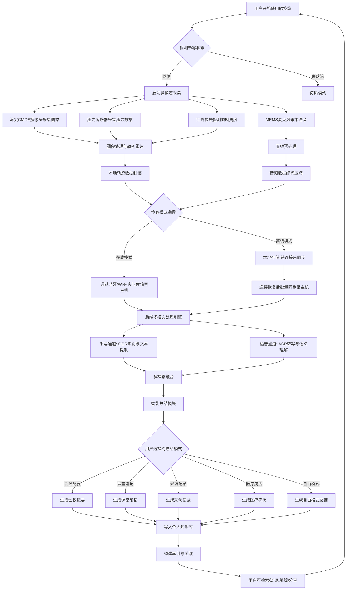
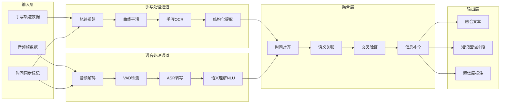
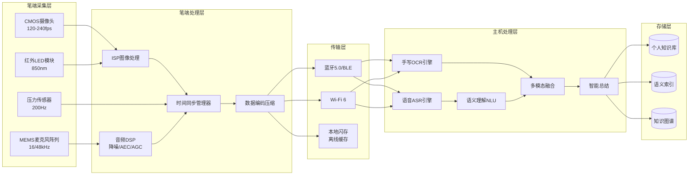

# 一种支持语音识别的笔

## 一、背景技术

目前市场上已有多种智能书写设备，能够实现纸质书写的数字化记录和同步，同时在语音采集与处理领域也存在大量成熟技术。现将相关背景技术分为书写和语音两大类分别阐述：

### 1.1 书写数字化技术

1. **点阵笔技术**
点阵笔是一种利用特殊点阵纸张实现数字化书写的技术。纸张表面印刷有微小的点阵图案,笔尖内置的摄像头识别这些点阵位置,从而记录书写轨迹。代表产品包括Livescribe智能笔、Neo smartpen等。这类产品需要使用专用的点阵纸张,书写内容可通过蓝牙或Wi-Fi传输到移动设备或电脑。

2. **电磁感应技术**
Wacom公司的Bamboo系列产品采用电磁感应技术,通过在书写板下方嵌入电磁感应层来捕捉触控笔的位置和压力。虽然这类产品主要用于数字绘图,但Wacom也推出了可以在普通纸张上书写的解决方案,如Bamboo Folio和Bamboo Slate,通过将纸张夹在特殊的书写板上,实现纸笔书写的同步数字化。

3. **超声波定位技术**
部分智能笔采用超声波和红外线结合的方式进行定位。笔尖发出超声波信号,接收器通过计算信号到达时间差来确定笔的位置。这种技术可以在普通纸张上使用,但需要在书写区域放置接收装置。

4. **光学识别技术**
一些产品使用笔尖集成的微型摄像头,通过光学识别技术追踪纸张表面的纹理或预先印刷的标记图案,从而记录书写内容。这种方式对纸张要求相对较低,但对光线环境有一定要求。

### 1.2 语音采集与处理技术

5. **录音笔技术**
传统录音笔通过内置麦克风阵列采集环境声音,存储为音频文件。代表产品包括索尼、Zoom等品牌的专业录音笔。这类设备专注于音频采集质量,但不具备与书写动作的联动能力。

6. **智能语音助手**
智能手机、智能音箱等设备集成了远场语音识别技术,通过麦克风阵列实现语音唤醒、识别和交互。这类技术以苹果Siri、Google Assistant、Amazon Alexa为代表,但其语音采集与书写场景完全独立,无法实现书写内容与语音内容的时间对齐和语义关联。

7. **语音转写服务**
基于云计算的语音转文字服务(如科大讯飞、Google Speech-to-Text、Whisper等)可将语音实时或离线转换为文本,但目前这类服务通常作为独立应用运行,缺乏与书写输入的深度融合。

### 1.3 现有多模态产品的局限

市场上存在一些同时具备录音和书写功能的智能笔(如Livescribe系列),但其存在以下不足：

- **依赖特殊纸张**：必须配合点阵纸使用,无法在任意表面书写
- **语音与书写简单叠加**：录音与书写仅为时间维度的并行记录,缺乏深层的语义关联和协同处理
- **缺乏智能总结能力**：仅提供原始音频和笔迹的回放,不具备自动提取、分类、归纳的能力
- **无法建立个人知识库**：数据以会话为单位孤立存储,不支持跨会话的知识组织和管理

因此,开发一种将书写数字化、语音采集与智能处理深度融合的多模态智能笔技术,具有重要的技术创新价值和广阔的市场前景。

## 二、现有技术的技术问题

现有技术存在以下主要缺点:

1. **书写与语音采集相互独立**
目前的智能书写设备和语音采集设备通常是分离的,即便少数产品(如Livescribe)将两者集成在同一设备中,也仅仅是物理层面的组合——录音和书写记录各自独立运行,缺乏数据层面的时间同步和语义关联。用户需要手动关联"哪段录音对应哪段笔记",极大地降低了使用效率和信息检索的便利性。

2. **依赖特殊书写介质**
现有的点阵笔技术必须使用专用的点阵纸张,这不仅增加了使用成本,还限制了应用场景。用户无法在普通纸张、笔记本或其他日常书写材料上自由使用,降低了产品的实用性和便携性。

3. **缺乏多模态信息融合能力**
现有的智能笔产品在采集到手写和语音信息后,通常将两种信息独立存储和展示,缺乏深层的融合处理能力。例如,无法自动将语音中的关键信息与手写笔记中的对应内容进行关联、互补和校验,导致信息利用效率低下。

4. **无智能提取与总结功能**
现有产品仅提供原始数据的存储和回放,用户需要自行阅读笔记和听取录音来提取有用信息。缺乏自动化的文本提取、关键信息识别、主题分类和智能总结能力,用户在信息整理上需要耗费大量时间和精力。

5. **不支持个性化知识管理**
现有产品的数据以单次会话或单页笔记为单位孤立存储,不支持跨会话、跨主题的知识组织和关联,无法帮助用户建立系统化的个人知识库或数据库。

6. **后端处理能力薄弱**
现有智能笔产品的配套软件通常只提供简单的笔迹显示和音频回放功能,缺乏强大的后端处理能力来对多模态数据进行深度分析、语义理解、结构化输出和个性化推荐。

开发一款融合书写数字化与语音识别的智能笔具有重要意义:

7. **实现多模态信息的协同采集**
用户在书写的同时自然地通过语音补充说明或记录思路,笔端同步采集两种信息并在时间维度上精确对齐,实现"边写边说"的自然交互方式,大幅提升信息记录的丰富度和完整性。

8. **智能化的信息处理与知识管理**
通过后端的多模态AI处理能力,自动从手写内容和语音内容中分别提取关键信息,进行语义融合和交叉验证,按用户指定的模式进行总结归纳,帮助用户高效地建立和管理个人知识库。

9. **拓展应用场景**
可广泛应用于教育(课堂笔记+教师讲解)、商务(会议记录+讨论内容)、医疗(病历书写+医嘱口述)、新闻采访(速记+采访录音)等多种场景,满足不同行业对多模态信息采集和处理的迫切需求。

## 三、技术方案的发明点概述

本发明提出一种集成语音采集模块的多模态智能触控笔,在已有的笔尖CMOS摄像头书写轨迹捕捉技术、压力传感器技术、红外倾斜检测技术和任意表面书写技术的基础上,增加麦克风语音采集模块,实现手写输入和语音输入的双通道同步采集,并通过后端多模态处理引擎分别对两种信息进行提取、转写和融合,最终按用户指定的模式进行总结归纳,帮助用户建立个人知识数据库。

**核心技术方案:**

在触控笔的笔身集成至少一个MEMS麦克风模块,用于采集用户在使用触控笔书写时的语音信息。麦克风采集的音频数据与笔尖CMOS摄像头采集的书写轨迹数据在时间维度上精确同步,通过统一的时钟基准实现数据对齐。两种模态的数据通过蓝牙或Wi-Fi传输至主机设备后,由后端多模态处理引擎分别进行:

- **手写通道**：笔迹图像 → 轨迹重建 → 手写文字识别(OCR) → 结构化文本提取
- **语音通道**：音频信号 → 降噪预处理 → 语音活动检测(VAD) → 语音转写(ASR) → 语义理解

两条通道的处理结果进行多模态融合,通过交叉验证和语义对齐提升信息完整度和准确度,最终按用户指定的模式(如会议纪要模式、课堂笔记模式、采访记录模式、医疗病历模式等)进行结构化总结和归纳,输出至用户的个人知识库。

**技术实现要点:**

1. **笔身MEMS麦克风阵列设计**
在触控笔笔身位置集成1-3个MEMS数字麦克风,采样率16kHz/48kHz可选,信噪比≥65dB。麦克风阵列支持波束成形技术,在书写场景下实现近场语音增强和环境噪声抑制。

2. **多模态时间同步机制**
主处理芯片生成统一时钟基准,音频帧和图像帧共享同一时间戳体系,确保手写轨迹点与语音片段的精确时间对齐,精度控制在±5ms以内。

3. **音频数据采集与预处理**
内置音频处理模块支持实时降噪、回声消除(AEC)和自动增益控制(AGC),在书写过程中有效降低笔尖与纸面的摩擦噪声,提升语音采集质量。

4. **双通道数据传输架构**
音频数据和轨迹数据通过时分复用或独立通道的方式经蓝牙5.0/Wi-Fi 6传输至主机,音频采用AAC/Opus编码压缩,轨迹采用自定义二进制协议,确保传输效率和实时性。

5. **后端多模态处理引擎**
主机端部署多模态AI处理引擎,包含手写识别模块、语音转写模块、多模态融合模块和智能总结模块,分别处理手写和语音信息并进行语义级别的融合。

6. **用户自定义总结模式**
提供多种预设总结模式(会议纪要、课堂笔记、采访记录、医疗病历等),用户也可自定义总结模板,系统根据选定模式对多模态信息进行结构化输出。

7. **个人知识库管理**
支持跨会话的知识组织,通过主题标签、时间线、语义检索等方式管理历史记录,实现个人知识的系统化积累和高效检索。

**技术优势:**
该方案将书写数字化与语音识别深度融合,在同一设备上实现双模态信息的同步采集和精确对齐,结合后端AI处理能力实现智能化的信息提取、融合和总结,帮助用户以最自然的方式(边写边说)高效记录和管理信息,无需依赖特殊纸张,支持任意表面书写,真正实现"所写即所得,所说即所记"。

## 四、技术方案的详细阐述

本技术方案通过在触控笔中集成语音采集模块并与已有的书写轨迹捕捉系统深度融合,实现多模态信息的同步采集和智能处理。以下详细阐述各关键技术点及其实现方式。

### 4.1 笔身MEMS麦克风阵列设计

**4.1.1 麦克风模块选型与布局**

在触控笔笔身位置集成MEMS数字麦克风阵列。麦克风采用底部进声型MEMS器件,尺寸为3.5mm×2.5mm×0.95mm,不增加笔身的有效直径。具体布局方案：

- **单麦克风方案**：在笔身上端(距离笔尖80-120mm处)内置1个MEMS麦克风,通过指向性声学设计,利用笔身的管状结构形成自然的声学波导管,增强来自笔顶端方向(用户口部方向)的语音信号。适用于成本敏感型产品。
- **双麦克风方案**：在笔身间隔20-40mm布置2个MEMS麦克风,形成线性阵列,支持基本的波束成形,实现方向性语音增强和环境噪声抑制。主麦克风靠近笔顶端,参考麦克风位于笔身中部。
- **三麦克风方案**：在笔身上端环形均匀分布3个MEMS麦克风,形成环形阵列,支持360度波束成形和声源定位,在复杂噪声环境下提供更强的语音增强能力。适用于高端产品。

**4.1.2 声学设计**

笔身作为管状结构,对声音传播具有天然的指向性效应。本发明充分利用这一物理特性进行声学设计：

1. **声学通道设计**：麦克风安装位置设有专用的声学进声孔,孔径0.5-1.0mm,通过L形或S形声学通道连接至MEMS芯片的进声口。声学通道内壁贴附吸音材料,减少腔体共振和驻波干扰。
2. **防风噪设计**：进声孔外侧覆盖防风网布(如声学阻尼布),有效降低书写时手部移动产生的风噪。防风网布的声阻值控制在20-50Rayl,在抑制风噪的同时不过度衰减语音信号。
3. **减振安装**：MEMS麦克风通过硅胶减振套安装在笔身内部,隔离书写时笔尖与纸面摩擦产生的结构传导噪声。减振套的固有频率设计在200Hz以下,有效隔离高频结构噪声。

**4.1.3 音频采集参数**

| 参数 | 规格 |
|------|------|
| 采样率 | 16kHz(语音模式) / 48kHz(高清录音模式) |
| 位深 | 24bit |
| 信噪比 | ≥65dB |
| 灵敏度 | -26dBFS |
| 频率响应 | 100Hz-8kHz(语音模式) / 20Hz-20kHz(高清模式) |
| 动态范围 | ≥80dB |
| 总谐波失真 | <1%(@1kHz,94dB SPL) |
| 等效输入噪声 | ≤29dB SPL(A计权) |

### 4.2 多模态时间同步机制

**4.2.1 统一时钟基准**

系统采用主处理芯片(MCU)的硬件定时器作为统一时钟基准,所有传感器数据共享同一时间坐标系。时钟精度优于±1ppm(每百万秒误差不超过1秒),确保长时间运行下的同步精度。

- **时钟分发**：主处理芯片通过内部总线向CMOS传感器、压力传感器、红外模块和音频ADC分发同步时钟信号。所有传感器以此时钟为基准生成各自的时间戳。
- **时间戳格式**：采用64位时间戳,高32位为秒数,低32位为微秒数,覆盖范围约136年,精度达微秒级。

**4.2.2 音视频数据对齐**

为精确对齐音频帧与图像帧的时间关系,系统采用以下机制：

1. **帧级同步**：音频以20ms为一帧(16kHz采样率下320个采样点),每帧携带精确的时间戳。CMOS传感器每帧图像同样携带时间戳。主处理芯片维护一个时间戳映射表,记录每帧音频和每帧图像的对应关系。
2. **硬件触发同步**：压力传感器的"落笔"事件作为硬件触发信号,同步标记音频录制起点和图像采集起点。当检测到笔尖压力超过阈值(如10gf)时,系统在该时刻插入同步标记,后续所有数据均以该标记为参考点进行时间对齐。
3. **时钟漂移补偿**：由于各传感器模块的时钟可能存在微小漂移,系统每秒进行一次时钟校正。主处理芯片比较各传感器的时间戳偏差,通过插值或抽取方式消除累积误差,确保长时间采集的同步精度控制在±5ms以内。

**4.2.3 数据包封装**

同步后的多模态数据按照统一的数据包格式进行封装：

```
数据包结构:
┌──────────┬──────────┬──────────┬──────────┬──────────┐
│ 包头(4B) │ 时间戳(8B)│ 类型标志(1B)│ 数据长度(2B)│ 有效载荷(变长)│
└──────────┴──────────┴──────────┴──────────┴──────────┘

类型标志:
  0x01: 书写轨迹数据(timestamp, x, y, pressure, angle)
  0x02: 音频帧数据(编码后的音频采样)
  0x03: 同步标记(落笔/抬笔事件)
  0x04: 图像帧数据(压缩后的CMOS图像)
```

### 4.3 音频信号预处理

**4.3.1 实时降噪处理**

由于书写场景下的噪声环境较为复杂(包含笔尖摩擦声、纸张翻页声、环境噪声等),系统内置多级降噪处理流水线：

1. **谱减法降噪**：对音频信号进行短时傅里叶变换(STFT),在频域中估计噪声功率谱,通过谱减法去除稳态噪声。帧长256点(16ms),帧移128点(8ms),使用汉宁窗减少频谱泄漏。
2. **维纳滤波降噪**：在谱减法的基础上,采用维纳滤波器进一步优化降噪效果。根据信噪比估计动态调整滤波器增益,在降噪和语音失真之间取得平衡。
3. **笔尖摩擦声抑制**：笔尖与书写表面摩擦产生的噪声频率集中在2-8kHz,具有宽带特性。系统通过以下方式专门抑制此类噪声：
   - 建立摩擦噪声模型：在不同书写表面(纸张、白板、桌面)和不同压力下,预先录制摩擦噪声样本,训练噪声模型参数
   - 压力关联降噪：利用压力传感器的实时数据,当检测到书写压力增大(摩擦声增强)时,自适应增强降噪强度;当笔尖抬起时,减弱降噪以保留更多语音细节
   - 动态阈值调节：根据当前书写状态动态调整语音活动检测(VAD)的阈值,避免将摩擦噪声误判为语音
4. **深度学习降噪(可选)**：笔端MCU算力允许时,可部署轻量级深度降噪模型(如基于RNN的降噪网络),在时域或时频域进行端到端的语音增强。模型参数量控制在100K以内,推理延迟<10ms。

**4.3.2 回声消除(AEC)**

当用户在使用触控笔的同时通过主机设备(如平板电脑)播放音频时(如观看教学视频、远程会议等场景),麦克风可能采集到扬声器播放的声音。系统内置回声消除模块：

1. 自适应滤波器估计扬声器到麦克风的声学传递函数
2. 根据估计的传递函数和参考信号(主机播放的音频),生成回声估计信号
3. 从麦克风采集信号中减去回声估计,消除回声干扰
4. 采用NLMS(归一化最小均方)或FDAF(频域自适应滤波)算法,收敛速度快,跟踪能力好

**4.3.3 自动增益控制(AGC)**

由于用户在书写时嘴部与麦克风的距离可能变化(如低头书写、抬头说话),系统通过AGC模块自动调节音频增益：

1. 目标响度设定为-26dBFS
2. 增益调节范围-12dB至+30dB
3. 攻击时间(增益下降)5ms,释放时间(增益上升)100ms
4. 采用多频段AGC,在不同频段独立调节增益,避免低频噪声被过度放大

### 4.4 双通道数据传输架构

**4.4.1 传输通道设计**

音频数据和书写轨迹数据通过蓝牙5.0或Wi-Fi 6传输至主机设备。系统支持两种传输模式：

1. **蓝牙模式(默认)**：
   - 音频通道：A2DP profile或自定义BLE GATT通道,音频采用Opus编码,比特率16-64kbps可调
   - 轨迹通道：自定义BLE GATT通道,轨迹数据采用二进制协议,带宽需求约5-20KB/s
   - 蓝牙总带宽需求：约30-100KB/s,在BLE高速模式下可满足
   - 延迟：端到端音频延迟控制在50-100ms,轨迹延迟控制在10-20ms

2. **Wi-Fi模式(高带宽)**：
   - 当需要实时传输CMOS图像帧或高清音频(48kHz采样)时,切换至Wi-Fi直连模式
   - 音频采用AAC编码,比特率64-128kbps
   - 图像帧采用JPEG压缩,单帧约10-30KB
   - Wi-Fi带宽可达数十Mbps,完全满足多通道数据同时传输
   - 延迟：端到端延迟控制在20-50ms

**4.4.2 带宽自适应机制**

系统根据当前数据量和传输条件动态调整传输策略：

1. **数据优先级**：轨迹数据(高优先级) > 音频数据(中优先级) > 图像帧数据(低优先级)
2. **带宽不足时降级策略**：
   - 第一级：降低图像帧的分辨率和帧率
   - 第二级：降低音频编码比特率(如从64kbps降至32kbps)
   - 第三级：仅传输轨迹数据和低质量音频,图像帧本地存储后批量同步
3. **离线缓存**：当无线连接中断时,音频和轨迹数据均在笔内本地缓存,恢复连接后自动同步

### 4.5 后端多模态处理引擎

**4.5.1 系统架构概述**

后端多模态处理引擎部署在主机设备(手机、平板、电脑或云端服务器)上,采用模块化流水线架构,包含以下核心模块：

```
┌─────────────────────────────────────────────────────────────────┐
│                    后端多模态处理引擎架构                          │
├─────────────────────────────────────────────────────────────────┤
│                                                                 │
│  ┌──────────────┐                    ┌──────────────┐           │
│  │  手写数据通道  │                    │  语音数据通道  │           │
│  │              │                    │              │           │
│  │ ┌──────────┐ │                    │ ┌──────────┐ │           │
│  │ │ 轨迹重建  │ │                    │ │ 音频解码  │ │           │
│  │ └────┬─────┘ │                    │ └────┬─────┘ │           │
│  │      ▼       │                    │      ▼       │           │
│  │ ┌──────────┐ │                    │ ┌──────────┐ │           │
│  │ │ 手写OCR  │ │                    │ │ 语音转写  │ │           │
│  │ └────┬─────┘ │                    │ │  (ASR)   │ │           │
│  │      ▼       │                    │ └────┬─────┘ │           │
│  │ ┌──────────┐ │                    │      ▼       │           │
│  │ │ 文本提取  │ │                    │ ┌──────────┐ │           │
│  │ └────┬─────┘ │                    │ │ 语义理解  │ │           │
│  │      │       │                    │ │  (NLU)   │ │           │
│  └──────┼───────┘                    │ └────┬─────┘ │           │
│         │                            └──────┼───────┘           │
│         ▼                                   ▼                   │
│  ┌──────────────────────────────────────────────────┐           │
│  │              多模态融合模块                         │           │
│  │  · 时间对齐  · 语义关联  · 交叉验证  · 信息补全     │           │
│  └──────────────────────┬───────────────────────────┘           │
│                         ▼                                       │
│  ┌──────────────────────────────────────────────────┐           │
│  │              智能总结模块                           │           │
│  │  · 模式匹配  · 结构化输出  · 标签生成  · 摘要提取   │           │
│  └──────────────────────┬───────────────────────────┘           │
│                         ▼                                       │
│  ┌──────────────────────────────────────────────────┐           │
│  │              知识库管理模块                         │           │
│  │  · 分类存储  · 索引构建  · 语义检索  · 关联推荐     │           │
│  └──────────────────────────────────────────────────┘           │
│                                                                 │
└─────────────────────────────────────────────────────────────────┘
```

**4.5.2 手写识别模块(OCR)**

手写数据通道的处理流程：

1. **轨迹重建**：接收笔端传输的轨迹坐标点序列,重建为完整的笔画轨迹。对轨迹进行曲线平滑(贝塞尔拟合)和去抖处理,生成高质量的数字墨迹。
2. **手写文字识别(OCR)**：
   - 采用基于深度学习的手写文字识别模型(如CRNN、TrOCR等)
   - 支持多语言识别:中文(简体/繁体)、英文、日文、韩文等
   - 支持数学公式、图表标注等特殊符号的识别
   - 单字识别准确率>98%,连续文本识别准确率>95%
3. **结构化文本提取**：
   - 段落识别：根据笔画的空间分布和间距自动划分段落
   - 标题识别：根据字号大小、位置等特征识别标题和层次结构
   - 列表识别：识别项目符号、编号列表等结构
   - 图文关联：识别手绘图形(如流程图、思维导图)与文字标注的关联关系
4. **数学内容识别(可选)**：
   - 支持手写数学公式的识别和LaTeX转换
   - 支持手绘图表的矢量化

**4.5.3 语音转写模块(ASR)**

语音数据通道的处理流程：

1. **音频解码**：对接收的编码音频数据进行解码(Opus/AAC),恢复为PCM音频流。
2. **语音活动检测(VAD)**：对音频流进行实时VAD,区分语音段和非语音段(静音、噪声等),仅对语音段进行后续处理,节省计算资源。
3. **语音转文字(ASR)**：
   - 采用端到端语音识别模型(如Whisper、Conformer等)
   - 支持多语言识别和自动语种检测
   - 支持实时流式转写和离线批量转写两种模式
   - 实时模式字错率(CER)<8%,离线模式字错率(CER)<5%
   - 自动添加标点符号和段落划分
4. **说话人分离(可选)**：
   - 当多人参与讨论时(如会议场景),自动识别和标记不同说话人
   - 采用声纹识别技术,支持2-10人的说话人分离
   - 输出带有说话人标签的转写文本

**4.5.4 多模态融合模块**

多模态融合是本发明的核心创新之一,实现手写和语音两种模态信息的语义级别融合：

1. **时间对齐**：
   - 利用笔端采集的统一时间戳,将手写内容的时间区间与语音内容的时间区间进行精确对齐
   - 例如：用户在10:05:00-10:05:30期间书写了一段笔记,同时在10:04:50-10:05:45期间有一段语音,系统判断两段内容时间高度重叠,将其关联为同一主题
2. **语义关联**：
   - 对手写文本和语音转写文本分别进行语义分析,提取关键词、实体、主题等语义信息
   - 基于语义相似度计算,将手写内容和语音内容中涉及相同主题的片段进行关联
   - 构建统一的语义图谱,节点为关键概念,边为语义关系
3. **交叉验证**：
   - 比对手写文本和语音文本中的共同信息,进行一致性校验
   - 当两种模态的信息一致时,提高该信息的置信度
   - 当两种模态的信息矛盾时,标记为待确认项,提示用户核实
4. **信息补全**：
   - 手写内容可能不完整(用户只记录了关键词或缩写),语音内容可能包含更详细的说明
   - 系统自动利用语音转写内容补全手写笔记中缺失的信息
   - 反之,手写中的图表、公式、关键数据也可以补充语音内容的不足
   - 生成融合后的完整信息记录,包含文字描述、关键数据、图表引用等

**4.5.5 智能总结模块**

智能总结模块根据用户选择的模式对多模态融合结果进行结构化输出：

1. **预设总结模式**：

   | 模式 | 输出结构 | 适用场景 |
   |------|---------|---------|
   | 会议纪要 | 议题 → 发言人 → 要点 → 决议 → 待办事项 | 商务会议 |
   | 课堂笔记 | 章节 → 知识点 → 公式/图表 → 例题 → 重点总结 | 教育学习 |
   | 采访记录 | 问答对 → 关键引用 → 背景信息 → 采访总结 | 新闻采访 |
   | 医疗病历 | 主诉 → 现病史 → 查体 → 诊断 → 处方 | 医疗记录 |
   | 读书笔记 | 章节 → 摘录 → 心得 → 关键词 → 思维导图 | 阅读学习 |
   | 自由模式 | 时间线 → 关键信息 → 标签 → 摘要 | 通用场景 |

2. **自定义模板**：
   - 用户可自定义总结模板,定义输出的字段名称、顺序和格式
   - 支持导入/导出模板,方便团队共享
   - 模板支持条件逻辑(如"如果检测到决议,则输出待办事项列表")

3. **智能标签生成**：
   - 基于融合内容的语义分析,自动生成主题标签(如"项目进度"、"技术方案"、"客户反馈"等)
   - 标签用于后续的知识库分类和检索
   - 支持用户自定义标签体系

4. **摘要提取**：
   - 利用大语言模型(LLM)生成多粒度摘要:
     - 一句话摘要(20字以内)
     - 短摘要(100字以内)
     - 详细摘要(300-500字)
   - 摘要中自动高亮关键信息和行动项

### 4.6 知识库管理模块

**4.6.1 知识存储结构**

每次采集会话生成的多模态数据按照以下结构存储在用户的个人知识库中：

```
知识库条目结构:
├── 会话元数据
│   ├── 会话ID、开始/结束时间
│   ├── 地理位置(可选)
│   ├── 总主题标签
│   └── 用户选择的总结模式
├── 原始数据
│   ├── 书写轨迹数据(矢量格式)
│   ├── 音频数据(原始录音)
│   └── 图像帧数据(按需)
├── 处理结果
│   ├── 手写OCR文本
│   ├── 语音转写文本(含说话人标签)
│   ├── 多模态融合结果
│   └── 结构化总结输出
├── 语义索引
│   ├── 关键词列表
│   ├── 实体列表(人名、地名、机构等)
│   ├── 主题向量(用于语义检索)
│   └── 时间索引
└── 关联信息
    ├── 关联的其他知识条目
    ├── 关联的标签
    └── 用户标注和评注
```

**4.6.2 检索与查询**

知识库支持多种检索方式：

1. **全文检索**：基于Elasticsearch或类似引擎,对OCR文本和语音转写文本进行全文索引和检索
2. **语义检索**：将知识条目转化为语义向量,支持基于自然语言的语义检索(如"上周讨论的预算方案")
3. **时间线检索**：按时间维度浏览和检索知识条目
4. **标签检索**：按主题标签分类浏览
5. **多模态检索**：支持通过手写草图或语音片段进行相似内容检索

**4.6.3 知识关联与推荐**

系统通过以下方式实现知识的自动关联和推荐：

1. **主题关联**：基于语义相似度,自动发现不同知识条目之间的主题关联,形成知识网络
2. **时序关联**：同一主题的连续多次记录自动串联,形成时间线视图
3. **智能推荐**：当用户创建新的知识条目时,系统自动推荐相关的历史记录,方便用户回顾和引用
4. **知识图谱**：长期积累后,系统自动构建用户的个人知识图谱,可视化展示知识领域、关联关系和知识盲区

### 4.7 业务流程图

**4.7.1 整体业务流程**



**4.7.2 多模态融合处理流程**



### 4.8 系统拓扑图

**4.8.1 硬件系统拓扑**

```
┌─────────────────────────────────────────────────────────────┐
│                      触控笔硬件拓扑                           │
│                                                             │
│  ┌─────────────────────────────────────────────────────┐    │
│  │                   笔尖模块                            │    │
│  │                                                     │    │
│  │   ┌──────────┐  ┌──────────┐  ┌──────────┐        │    │
│  │   │   CMOS   │  │  红外LED │  │ LED补光灯│        │    │
│  │   │  传感器   │  │  投射模块│  │  补光模块│        │    │
│  │   │ 640×480  │  │  850nm   │  │ 5000K    │        │    │
│  │   └────┬─────┘  └────┬─────┘  └────┬─────┘        │    │
│  │        │              │              │              │    │
│  │   ┌────┴─────┐  ┌────┴─────┐  ┌────┴─────┐        │    │
│  │   │  压力传感器│  │  准直透镜 │  │ 导光结构  │        │    │
│  │   │  0-500gf │  │          │  │          │        │    │
│  │   └────┬─────┘  └──────────┘  └──────────┘        │    │
│  │        │                                            │    │
│  └────────┼────────────────────────────────────────────┘    │
│           │                                                  │
│  ┌────────┼────────────────────────────────────────────┐    │
│  │        ▼         笔身处理与通信模块                    │    │
│  │                                                     │    │
│  │   ┌──────────────────────────────────┐             │    │
│  │   │     主处理芯片(MCU/SoC)            │             │    │
│  │   │  ┌─────────┐  ┌───────────────┐  │             │    │
│  │   │  │  ISP    │  │  音频DSP      │  │             │    │
│  │   │  │图像处理  │  │ 降噪/AEC/AGC  │  │             │    │
│  │   │  └─────────┘  └───────────────┘  │             │    │
│  │   │  ┌─────────┐  ┌───────────────┐  │             │    │
│  │   │  │轨迹重建  │  │ 时间同步管理  │  │             │    │
│  │   │  └─────────┘  └───────────────┘  │             │    │
│  │   └──────────┬───────────────────────┘             │    │
│  │              │                                      │    │
│  │   ┌──────────┼─────────────────────┐               │    │
│  │   │          ▼                      │               │    │
│  │   │  ┌──────────┐  ┌──────────┐    │               │    │
│  │   │  │MEMS麦克风 │  │ 闪存     │    │               │    │
│  │   │  │  阵列    │  │512MB-4GB │    │               │    │
│  │   │  │1-3个    │  │          │    │               │    │
│  │   │  └──────────┘  └──────────┘    │               │    │
│  │   │                                 │               │    │
│  │   │  ┌──────────┐  ┌──────────┐    │               │    │
│  │   │  │蓝牙5.0   │  │ Wi-Fi 6  │    │               │    │
│  │   │  │ /BLE     │  │ (可选)   │    │               │    │
│  │   │  └──────────┘  └──────────┘    │               │    │
│  │   │                                 │               │    │
│  │   │  ┌──────────┐                   │               │    │
│  │   │  │ 电池模块  │                   │               │    │
│  │   │  │ 锂电池   │                   │               │    │
│  │   │  └──────────┘                   │               │    │
│  │   └─────────────────────────────────┘               │    │
│  └─────────────────────────────────────────────────────┘    │
└─────────────────────────────────────────────────────────────┘
```

**4.8.2 端到端系统拓扑**

```
┌──────────┐                                      ┌──────────┐
│          │     蓝牙5.0 / Wi-Fi 6               │          │
│  触控笔  │◄════════════════════════════════════►│  主机设备 │
│  (笔端)  │     双通道数据传输                    │          │
│          │                                      │          │
│ ·CMOS    │                                      │ ·手机    │
│ ·压力    │                                      │ ·平板    │
│ ·红外    │                                      │ ·电脑    │
│ ·麦克风  │                                      └────┬─────┘
│ ·存储    │                                           │
│ ·MCU    │                                           │
└──────────┘                                           │
                                                       ▼
                                    ┌──────────────────────────────┐
                                    │     后端多模态处理引擎         │
                                    │                              │
                                    │  ┌────────┐   ┌────────┐   │
                                    │  │手写OCR │   │语音ASR │   │
                                    │  │模块    │   │模块    │   │
                                    │  └───┬────┘   └───┬────┘   │
                                    │      ▼            ▼         │
                                    │  ┌──────────────────────┐   │
                                    │  │   多模态融合模块      │   │
                                    │  └──────────┬───────────┘   │
                                    │             ▼               │
                                    │  ┌──────────────────────┐   │
                                    │  │   智能总结模块        │   │
                                    │  └──────────┬───────────┘   │
                                    │             ▼               │
                                    │  ┌──────────────────────┐   │
                                    │  │   知识库管理模块      │   │
                                    │  └──────────┬───────────┘   │
                                    └─────────────┼───────────────┘
                                                  │
                                                  ▼
                                    ┌──────────────────────────────┐
                                    │     个人知识数据库             │
                                    │                              │
                                    │  ·知识条目(多模态)            │
                                    │  ·语义索引                    │
                                    │  ·知识图谱                    │
                                    │  ·标签体系                    │
                                    └──────────────────────────────┘
```

**4.8.3 数据流拓扑**



### 4.9 电源管理与续航优化

增加麦克风模块和音频处理模块后,系统功耗有所增加,需进行针对性优化：

1. **音频模块功耗管理**：
   - MEMS麦克风工作电流约0.5-1mA/个,3个麦克风阵列总电流约1.5-3mA
   - 音频DSP模块工作电流约5-15mA,空闲时自动进入低功耗模式(<100μA)
   - 仅在检测到书写动作时启动麦克风采集,待机时麦克风进入休眠

2. **智能唤醒机制**：
   - 压力传感器检测到落笔动作时,通过硬件中断唤醒音频模块
   - 支持语音唤醒词(如"开始录音"),通过低功耗关键词检测芯片(KWS)实现,待机功耗<1mW
   - 抬笔超过设定时间(如30秒)后,音频模块自动休眠

3. **续航预估**：
   - 笔身电池容量200-300mAh
   - 书写+录音综合功耗约30-50mA
   - 连续使用续航约4-8小时
   - 待机续航可达30天以上

## 五、技术效果

本发明的技术方案产生了以下有益效果：

1. **多模态信息的同步采集与精确对齐**
通过在同一设备中集成书写传感器和麦克风阵列,采用统一时钟基准实现手写轨迹和语音数据的精确时间同步,解决了现有技术中书写与语音采集相互独立、需要手动关联的问题。用户可以自然地"边写边说",无需额外操作即可同步记录两种模态的信息。

2. **任意表面书写与语音采集的融合**
在已有的任意表面书写技术基础上(基于笔尖CMOS摄像头的光学识别、红外倾斜检测、压力传感),增加语音采集能力,使触控笔成为一种真正的多模态信息采集终端,无需特殊纸张或额外设备,在任何表面书写的同时即可采集语音。

3. **双通道信息的智能提取与转写**
后端多模态处理引擎分别通过手写OCR通道和语音ASR通道对两种模态的信息进行独立的提取和转写,手写内容转化为结构化文本,语音内容转化为带标点和说话人标签的转写文本,信息提取的准确性和完整性显著优于单一通道处理。

4. **多模态语义融合提升信息质量**
通过时间对齐、语义关联、交叉验证和信息补全四种融合策略,将手写和语音两种模态的信息在语义层面深度融合。手写的关键词、公式、图表与语音的详细说明相互补充,语音内容可补全手写中省略的信息,手写内容可纠正语音转写中的错误,最终输出的融合信息质量显著高于任意单一通道。

5. **按用户指定模式的智能总结归纳**
提供会议纪要、课堂笔记、采访记录、医疗病历、读书笔记等多种预设总结模式,以及自定义模板功能,系统根据用户选择的模式自动将多模态融合信息进行结构化输出,大幅减少了用户手动整理信息的工作量,从传统的数小时缩短至数秒。

6. **个人知识库的系统化构建与管理**
通过自动化的标签生成、语义索引构建、知识图谱管理和多维度检索能力,帮助用户将每次采集的信息系统化地组织在个人知识库中,支持跨会话的知识关联和推荐,实现知识的长期积累和高效利用。

7. **优异的环境适应能力**
麦克风阵列结合笔身声学设计,在书写场景下实现有效的笔尖摩擦噪声抑制、回声消除和自动增益控制,确保在各种环境条件下(安静办公室、嘈杂会议室、户外等)都能采集到高质量的语音信号。

8. **低功耗设计与长续航**
通过智能唤醒机制、动态帧率调节、音频模块休眠策略等电源管理技术,在增加语音采集功能的同时保持合理的续航能力,连续使用4-8小时,待机30天以上,满足日常使用需求。

9. **灵活的数据传输与离线支持**
支持蓝牙和Wi-Fi双模传输,根据数据量和传输条件自适应切换;离线模式下所有数据本地存储,恢复连接后自动同步,确保在任何使用场景下都不会丢失数据。

## 六、术语解释

| 术语 | 解释 |
|------|------|
| MEMS麦克风 | 微机电系统(Micro-Electro-Mechanical System)麦克风,一种基于半导体工艺制造的微型麦克风,具有体积小、功耗低、一致性好的特点 |
| CMOS传感器 | 互补金属氧化物半导体图像传感器,一种将光信号转换为电信号的器件,广泛用于摄像头模组 |
| OCR | 光学字符识别(Optical Character Recognition),将图像中的文字转换为可编辑文本的技术 |
| ASR | 自动语音识别(Automatic Speech Recognition),将语音信号转换为文本的技术 |
| NLU | 自然语言理解(Natural Language Understanding),对文本进行语义分析、意图识别等信息提取的技术 |
| VAD | 语音活动检测(Voice Activity Detection),区分语音段和非语音段的技术 |
| AEC | 回声消除(Acoustic Echo Cancellation),消除扬声器回声对麦克风采集干扰的技术 |
| AGC | 自动增益控制(Automatic Gain Control),自动调节音频信号增益的技术 |
| ISP | 图像信号处理器(Image Signal Processor),对原始图像数据进行处理的专用硬件模块 |
| 波束成形 | Beamforming,利用麦克风阵列的信号处理技术,增强特定方向的语音信号,抑制其他方向的噪声 |
| LLM | 大语言模型(Large Language Model),具有强大文本理解和生成能力的深度学习模型 |
| InkML | 墨迹标记语言,万维网联盟(W3C)制定的网络墨迹数据表示标准 |
| MIPI CSI-2 | 移动产业处理器接口相机串行接口第二代,一种高速串行接口标准,用于连接摄像头和处理器 |
| 多模态融合 | 将不同类型(模态)的信息(如文本、语音、图像)进行整合处理的技术 |
| 知识图谱 | 以图形结构表示知识的技术,节点代表实体,边代表实体间的关系 |
| Opus | 一种开源的有损音频编码格式,在低延迟和低比特率下具有优秀的音质表现 |
